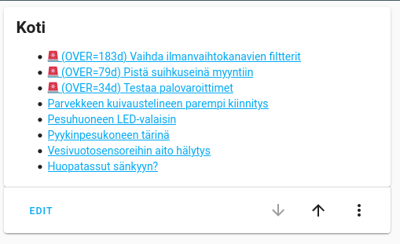

Todoist doesn't offer task export in RSS format. This program fixes that.

This runs can either run as local HTTP endpoint or as AWS Lambda microservice.

I wanted to
[display my Todoist tasks as native Markdown panel in Home Assistant](https://joonas.fi/2020/08/displaying-rss-feed-with-home-assistant/)
(the blog post guides to how you can push RSS to Home Assistant)

This program decorates task names (in RSS) with prefix:

- ✅ for completed tasks and
- 🚨 for overdue tasks

RSS entry URLs are links to Todoist UI.

Get API token from Todoist
--------------------------

You can find it from `Settings > Integrations > API token`

RSS feed location
-----------------

Once the HTTP service is running, your RSS feeds are available at
`/api/todoist-to-rss/project/{project}/tasks.xml?token={api_token}`.

You can find Todoist project ID from URL in Todoist browser app.
